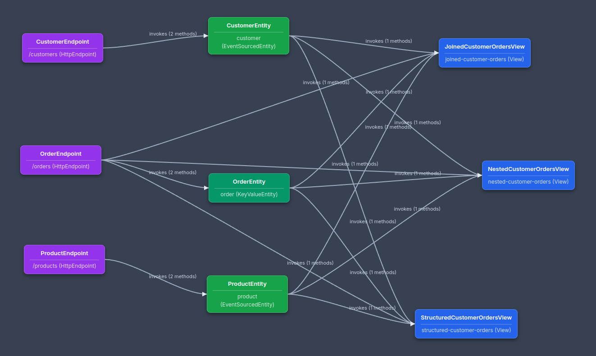

# **Akka Component Diagram Generator for VSCode**

This VSCode extension scans your Java project for Akka SDK components and generates an interactive, visual diagram of their relationships. It uses advanced CST (Concrete Syntax Tree) parsing to accurately detect component interactions and dependencies.



## **Features**

* **Advanced CST Parsing**: Uses Java CST parsing for accurate detection of Akka SDK components and their interactions.
* **Component Detection**: Automatically finds Akka SDK components like Endpoints, Entities, Views, Consumers, Workflows, and more.
* **Method Chain Detection**: Detects fluent API calls like `componentClient.forAgent().inSession().method(HelloWorldAgent::greet).invoke()` with flexible method chain support.
* **Topic Support**: Detects `@Produce.ToTopic` and `@Consume.FromTopic` annotations and creates topic nodes in the diagram.
* **Service Stream Support**: Detects `@Produce.ServiceStream` and `@Consume.FromServiceStream` annotations and creates service stream nodes.
* **Interactive Diagram**: Renders components as nodes and their interactions as labeled edges in a dedicated editor tab.
* **Mermaid Diagram Generation**: Generate Mermaid markdown diagrams for documentation, presentations, or sharing with other tools.
* **Marquee Selection**: Hold `Shift` key while clicking and dragging on the diagram background to draw a selection box. Or, while holding the `Shift` key, click other nodes to select multiple nodes.
* **Manual Layout with Persistence**: Manually arrange the diagram by dragging nodes. Your custom layout, pan, and zoom settings are saved and restored between sessions.
* **Click-to-Navigate**: Simply click on any component node in the diagram to instantly open the corresponding source file and jump to the class definition.
* **Scoped Scans**: Right-click on any folder in the VSCode File Explorer to generate a diagram for just that part of your project.
* **Detailed Interaction Tooltips**: Hover over the connection lines between components to see a detailed list of the specific methods being invoked.

## **Supported Annotations**

The extension detects the following Akka SDK annotations:

* **`@ComponentId`**: Marks a class as an Akka component
* **`@HttpEndpoint`**: Marks a class as an HTTP endpoint
* **`@GrpcEndpoint`**: Marks a class as a gRPC endpoint
* **`@MCPEndpoint`**: Marks a class as an MCP endpoint
* **`@Produce.ToTopic("topic-name")`**: Indicates the component produces messages to a topic
* **`@Consume.FromTopic("topic-name")`**: Indicates the component consumes messages from a topic
* **`@Produce.ServiceStream("service-name")`**: Indicates the component produces to a service stream
* **`@Consume.FromServiceStream("service-name")`**: Indicates the component consumes from a service stream

## **Installation**

Currently, the extension is distributed via a .vsix file available on the project's GitHub releases page.

1. Go to the [Releases Page](https://github.com/mckeeh3/akka-component-diagram-vscode-extension/releases).
2. Download the latest .vsix file.
3. In VSCode, open the **Extensions** view from the side bar.
4. Click the "More Actions" (**...**) button at the top of the Extensions view.
5. Select **Install from VSIX...** and choose the .vsix file you downloaded.
6. Reload the extension if prompted.

## **How to Use**

The primary way to use the extension is through the File Explorer context menu.

1. Open your Akka-based Java project in VSCode.
2. In the **File Explorer** side panel, right-click on the folder (e.g., your main java source root) that you want to visualize.
3. Select **Akka: Generate Component Diagram** from the context menu.
4. A new editor tab will open, displaying the interactive component diagram.

**Note**: The extension reuses the same diagram tab for subsequent scans, so you won't get multiple diagram tabs. This preserves your layout and view settings when scanning different folders.

### **Available Commands**

* **Akka: Generate Component Diagram**: Generate a diagram for the selected folder or the entire workspace
* **Akka: Clear Saved Diagram Layout**: Clear all saved node positions and view settings (accessible via `Ctrl+Shift+P` command palette)
* **Akka: Generate Mermaid Diagram**: Generate a Mermaid markdown diagram from your Akka components (accessible via `Ctrl+Shift+P` mac `cmd+Shift+P` command palette)

### **Interacting with the Diagram**

* **Rearrange Layout**: Left-click and drag any component node to a new position. The layout is saved automatically.
* **Navigate to Code**: Left-click on any component node.
* **Pan the View**:
  * Mouse: Click and drag on the diagram's background.
  * Mac Trackpad: Press down with one finger and drag.
  * Multiple Nodes: After selecting multiple nodes, click and drag any node from the group to move them all together. Your layout is saved automatically.
* **Zoom the View**:
  * Mouse: Use the mouse wheel, or use the `+` and `-` keys, or use the `0` key to reset the zoom.
  * Mac Trackpad: Use a two-finger drag gesture (up to zoom out, down to zoom in) or a pinch-to-zoom gesture.
  * Marquee Selection: Hold `Shift` while clicking and dragging on the diagram background to draw a selection box.
* **Delete Selected Nodes**: Click anywhere on the diagram's background (without holding `Shift`) or press the `Escape` key.

### **Generating Mermaid Diagrams**

The extension can generate Mermaid markdown diagrams for documentation and sharing:

1. **Open or create a markdown file** in VSCode
2. **Run the command** `Ctrl+Shift+P` mac `cmd+Shift+P` → "Akka: Generate Mermaid Diagram"
3. **Follow the prompts** to specify the source folder to scan
4. **The diagram will be generated** and saved to your markdown file

The generated Mermaid diagram includes:

* **Color-coded nodes** for different component types (endpoints, entities, views, etc.)
* **Labeled connections** showing method invocations and data flow
* **Topic and service stream nodes** with dashed borders
* **Professional styling** suitable for documentation and presentations
* **Configurable themes** (default, forest, dark, neutral) via VSCode settings

You can then use any Mermaid-compatible viewer or renderer to display the diagram.

### **Viewing Mermaid Diagrams**

To view the generated Mermaid diagrams in VSCode, you can use these extensions:

* **Markdown Preview Mermaid Support**: Enables Mermaid diagram rendering in VSCode's built-in markdown preview
* **Mermaid Preview**: Dedicated extension for viewing Mermaid diagrams
* **Markdown All in One**: Includes Mermaid support along with other markdown features

**Installation:**
1. Open VSCode Extensions view (`Ctrl+Shift+X`)
2. Search for "Markdown Preview Mermaid Support"
3. Install the extension
4. Open your generated markdown file
5. Use `Ctrl+Shift+V` to open the markdown preview

The diagrams will render automatically in the preview pane, showing your Akka component relationships with the configured theme and styling.


## **Configuration**

The extension supports the following configuration options:

### **Mermaid Theme**

Configure the theme for generated Mermaid diagrams:

- **Setting**: `akkaDiagramGenerator.mermaidTheme`
- **Default**: `neutral`
- **Options**: `default`, `forest`, `dark`, `neutral`

You can change this setting in VSCode's settings (File → Preferences → Settings) or by editing your `settings.json` file:

```json
{
  "akkaDiagramGenerator.mermaidTheme": "dark"
}
```

## **Technical Details**

The extension uses advanced Java CST parsing to accurately detect:

* **Component Declarations**: Classes annotated with Akka SDK annotations
* **Method Invocations**: Component client calls with fluent API chains
* **Topic Interactions**: Produce/consume annotations for messaging topics
* **Service Stream Interactions**: Produce/consume annotations for service streams
* **Flexible Method Chains**: Supports additional methods like `.inSession()` between required calls

The CST-based approach provides more accurate detection compared to regex-based parsing, especially for complex method chains and nested expressions.

## **License**

This extension is open source and available under the [MIT License](http://docs.google.com/LICENSE.md).
