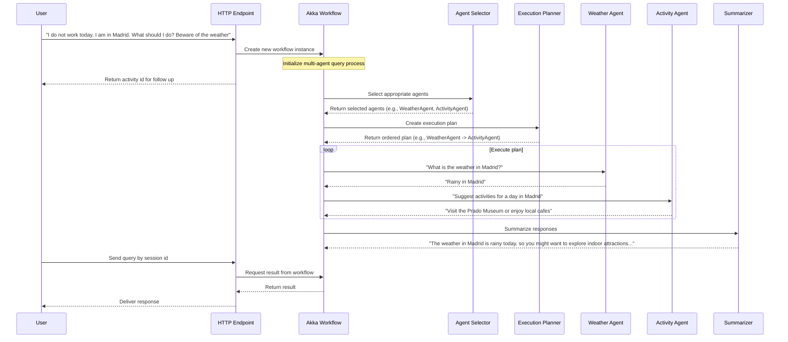

# Multi-Agent System

A sample application demonstrating how to build a multi-agent system using Akka and an LLM model.

## Overview

This project illustrates an Agentic workflow for a multi-agent system using Akka. The system:

- Processes user queries and determines the appropriate agents to handle the request
- Plans the execution order of the selected agents
- Executes the plan by interacting with the agents in sequence
- Summarizes the results from all agents into a final response

### Akka components

This sample leverages specific Akka components:

- **Workflow**: Manages the user query process, handling the sequential steps of agent selection, plan creation, execution, and summarization.
- **EventSourced Entity**: Maintains the session memory, storing the sequence of interactions between the user and the system.
- **HTTP Endpoint**: Serves the application endpoints for interacting with the multi-agent system (`/activities`).

### Other

- **LLM model**: The system uses an LLM model to assist in agent selection, plan creation, and summarization. The LLM is integrated with tools specific to each agent's domain of expertise.

## Example flow



Note that the agents selected depend on the user's query and the available agents. Thus, the flow varies arbitrarily depending on the Planner agent reasoning and the steps selected to respond to the query. Also, another important aspect is that all agents share the same context and thus, when answering a question can take into consideration the context of the previous interactions with other agents. 

## Running the application

### Prerequisites
- Java 21 or higher
- Maven 3.6 or higher

### Build and run

To run the application, you need to provide the following environment variables:
- `OPENAI_API_KEY`: Your OpenAI API key
- `WEATHER_API_KEY`: (Optional) API key for the weather service

Set the environment variables:

- On Linux or macOS:

  ```shell
  export OPENAI_API_KEY=your-openai-api-key
  export WEATHER_API_KEY=your-weather-api-key
  ```

- On Windows (command prompt):

  ```shell
  set OPENAI_API_KEY=your-openai-api-key
  set WEATHER_API_KEY=your-weather-api-key
  ```

Build and run the application:
```shell
# Run the application
mvn compile exec:java
```

### Testing the agents

With the application running, you can test the system using the following endpoints:

* Start a new session:
```shell
curl -i -XPOST --location "http://localhost:9000/activities/alice" \
  --header "Content-Type: application/json" \
  --data '{"message": "I do not work tomorrow. I am in Madrid. What should I do? Beware of the weather"}'
```

The system will process the query, select the appropriate agents, and return a response.

* Retrieve the response for a specific session:
```shell
curl -i -XGET --location "http://localhost:9000/activities/alice/{sessionId}"
```

Replace `{sessionId}` with the ID returned when the session was created. Example:

```shell
$ curl "http://localhost:9000/activities/alice/c1219e5a-abae-44c0-959b-ff76aa22cb2e"

The weather in Madrid is rainy tomorrow, so you might want to explore indoor attractions like the Prado Museum or Reina Sofia Museum. Alternatively, you can visit local cafes and food markets, such as Mercado de San Miguel, to enjoy some culinary delights without getting wet. If you're up for something more active, you could also consider visiting an escape room or an indoor sports facility. 
```

You can also retrieve for all previous suggestions for a user:

```shell
curl -i -XGET --location "http://localhost:9000/activities/alice"
```

Preferences can be added with:

```shell
curl -i localhost:9000/preferences/alice \
  --header "Content-Type: application/json" \
  -XPOST \
  --data '{
    "preference": "I like outdoor activities."
  }'
```

## Deployment

You can use the [Akka Console](https://console.akka.io) to create a project and deploy this service.

Build container image:
```shell
mvn clean install -DskipTests
```
Install the `akka` CLI as documented in [Install Akka CLI](https://doc.akka.io/reference/cli/index.html).

Set up secret containing OpenAI API key:
```shell
akka secret create generic agent-secrets \
  --literal openai-key=$OPENAI_API_KEY \
  --literal weather-key=$WEATHER_API_KEY
```

Deploy the service using the image tag from above `mvn install` and the secrets:
```shell
akka service deploy multi-agent multi-agent:<tag-name> --push \
  --secret-env OPENAI_API_KEY=agent-secrets/openai-key \
  --secret-env WEATHER_API_KEY=agent-secrets/weather-key
```

Refer to [Deploy and manage services](https://doc.akka.io/operations/services/deploy-service.html)
for more information.

To understand the Akka concepts that are the basis for this example, see [Development Process](https://doc.akka.io/concepts/development-process.html) in the documentation.
